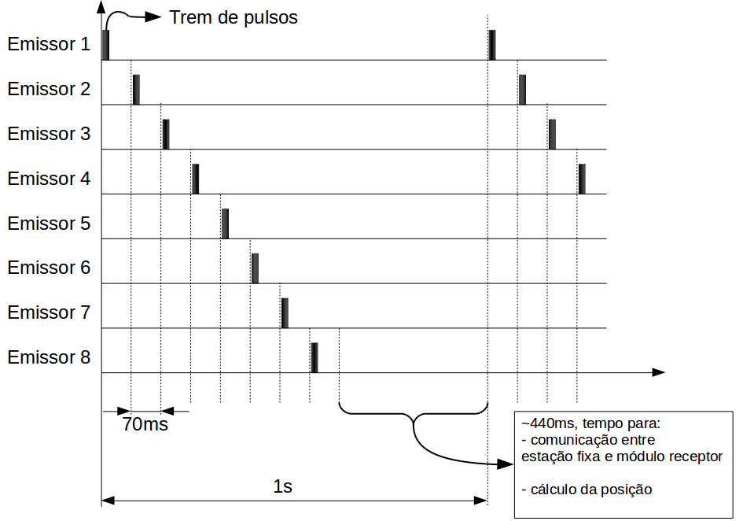
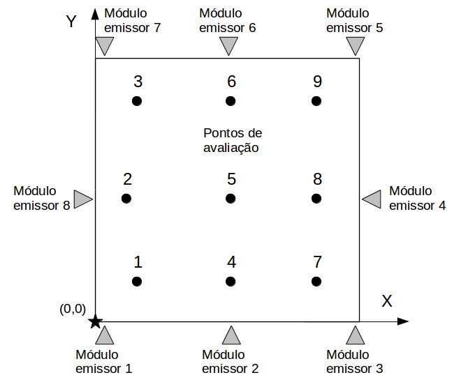
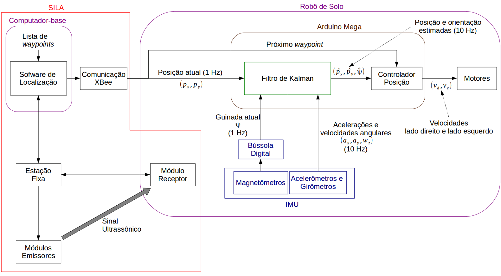
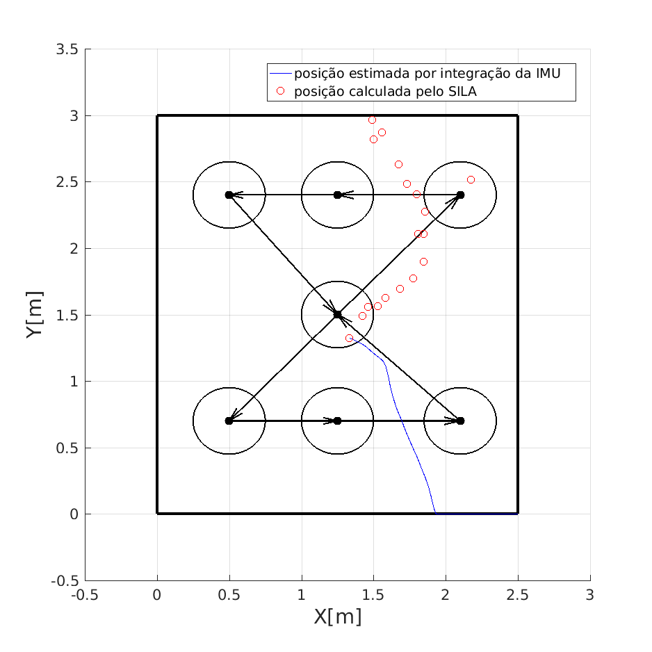
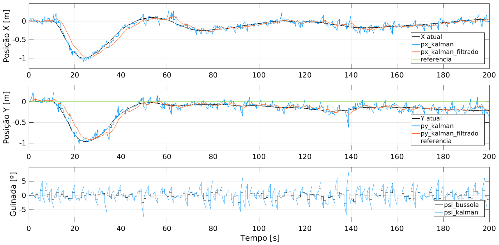

# ALOS

> **Note:** All code in this repository was written by Kleber Cabral. The README documentation and inline code comments were added with AI assistance (Claude).

Source code, firmware, PCB designs and experiment data for **"ALOS: Acoustic Localization
System Applied to Indoor Navigation of UAVs"** (ICCSPA 2019), by Kleber M. Cabral,
Sérgio R. Barros dos Santos, Cairo L. Nascimento Jr., and Sidney N. Givigi Jr., derived
from Kleber's Master's work at ITA (2017–2018).

**Paper:** [doi:10.1109/ICCSPA.2019.8713689](https://doi.org/10.1109/ICCSPA.2019.8713689) ·
**Slides:** [presentation/ICCSPA2019_slides.pdf](presentation/ICCSPA2019_slides.pdf)

## What it does

ALOS is an indoor localization system built from low-cost ultrasonic modules. Eight fixed
emitters fire in turn, synchronized by a 433 MHz RF pulse from a fixed station; a receiver
on the vehicle measures each time of flight and reports it over an nRF24L01 link. A PC
turns the ranges into a position (least squares, Taylor series or approximate maximum
likelihood), and an extended Kalman filter fuses that position with the vehicle's IMU.
The system gives a 3D position at about 1 Hz.

It was validated with a ground robot driving in a 2.5 m × 3 m area and with a simulated
quadrotor in V-REP that uses the measured ALOS error characteristics.

Labels inside the figures are in Portuguese, as in the dissertation they were drawn for.
"SILA" in them is the Portuguese acronym for ALOS.

## How it works

The emitters (*Emissores Ultrassônicos*) are fixed around the room at known positions. The
base computer sends a synchronization message by RF (purple), each emitter answers with an
ultrasonic burst, and the receiver on the vehicle (*Receptor Ultrassônico*) times how long
each burst takes to arrive. Those times of flight are the distances d1…d4 in red. The
computer requests the measurements (green), solves for the position and sends it back to
the vehicle (blue).

Only one emitter can be heard at a time, so they take turns. After the synchronization
pulse, emitter 1 fires immediately and each following emitter waits 70 ms more than the
previous one, which is long enough for the echoes of the last burst to die out. The
remaining ~440 ms of each one-second cycle is used to collect the measurements over the
radio link and compute the position. This is what sets the 1 Hz update rate.

## Hardware

| Emitter | Receiver | Fixed station |
|---|---|---|
|  |  |  |
| Arduino Nano, 433 MHz RF receiver for the synchronization pulse, and a driver stage for several ultrasonic transducers pointing in different directions to widen the beam. | Arduino Nano, the same RF receiver, an nRF24L01 radio to report measurements, and an amplifier/filter stage for the receiving transducers. | Arduino with a 433 MHz transmitter (synchronization) and an nRF24L01 transceiver (measurement requests and replies), connected to the PC over USB. |

All three boards were designed in Proteus; the projects, schematic PDFs and Gerber files
are in `hardware/`.

The emitters were mounted high on the walls of the test room. The photo shows three of
the eight.

## Software

The PC side is a MATLAB GUI. It shows the eight measured distances, the emitter positions,
the computed position of the mobile module (least squares and Taylor series) on a 3D plot,
and the waypoint the robot is currently heading to. It also runs the speed-of-sound
calibration.

## Results

### Range measurements

Repeated measurements between one emitter and one receiver placed 3 m apart. The
horizontal axis is the measured distance in metres and the vertical axis the number of
samples. The readings stay within a few centimetres of the true distance, which is the
raw accuracy the position solver starts from.

### Static position accuracy

The receiver was placed at nine known points (*Pontos de avaliação*) inside the area
covered by the eight emitters (*Módulo emissor* 1–8), at several heights, and the position
computed by each algorithm was compared with the true one. The logs and plotting scripts
are in `experiments/Calculo_pos_lms_ts_aml/` and `experiments/Comparacao_LMS_TS/`.

### Ground robot

| | |
|---|---|
|  |  |

The robot is a mecanum-wheel platform carrying an Arduino Mega, an IMU and the ALOS
receiver module. On board, a Kalman filter combines the ALOS position (1 Hz), the compass
heading (1 Hz) and the accelerometers and gyros (10 Hz) to estimate position and heading
at 10 Hz, and a position controller drives the motors towards the next waypoint. The
waypoint list comes from the PC over an XBee link.

The robot was asked to follow an hourglass-shaped path through seven waypoints (black
dots; the circles are the acceptance radius around each one). Red circles are the raw
ALOS positions and the blue line is the Kalman filter estimate that the controller used.
The robot completes the path, with the estimate following the ALOS fixes and filling in
between them.

For comparison, the blue line here is the position obtained by integrating the IMU alone
on the same data. It quickly drifts out of the test area, which shows that the
ALOS fixes are what keep the estimate usable.

### Simulated quadrotor

| | |
|---|---|
|  |  |

The second case study is a quadrotor simulated in V-REP, with the controllers and the
Kalman filter running in MATLAB/Simulink. The simulated ALOS measurement reproduces the 1 Hz
rate and the error characteristics measured on the real system. The plots show the X position, Y
position and heading over time: the true value, the Kalman estimate, its filtered version
and the reference, with a lead compensator closing the position loop.

## Videos

- [Ground robot test with wall-mounted emitters](https://youtu.be/pdVNUMOguDg)
- [Quadrotor altitude test on a guided test stand](https://youtu.be/xUeMERxlmYQ)

## Structure

| Folder | Contents |
|---|---|
| `firmware/` | Arduino sketches. `emissor_us`, `receptor_us` and `modulo_fixo` are the three ALOS modules (emitter, receiver, fixed station). `RoboSolo_*` and `GroundRobot*` run the ground robot (AHRS, Kalman filter, controllers, SD logging, XBee). `quadMainSoftware_*`, `Teste_altura` and `coletar_dados_imu_vooQuad` are for the real quadrotor. `AHRS*` are standalone attitude estimators. |
| `matlab/location_system/` | The PC side: a MATLAB GUI (`LocationSystem_v2.m`, `interface.m`) that talks to the fixed station over serial, calibrates the speed of sound and computes positions (`LS.m`, `taylor_series.m`, `aml.m`). The GUI layout file `interface.fig` and the logs of the two-receiver session are not included, so the layout has to be rebuilt in GUIDE before the GUI runs. |
| `matlab/localization_algorithms/` | Offline comparison of trilateration, least squares, Taylor series and AML, and a study of emitter placement. |
| `matlab/kalman3d/` | Standalone 3D Kalman filter fusing ALOS position with IMU data. |
| `matlab/tools/` | Small scripts: log import, outlier (Hampel) filter test, accelerometer vibration FFT, calibration simulation. |
| `hardware/` | Proteus projects, schematic PDFs and CAD/CAM (Gerber) archives for the emitter, receiver and fixed-station boards. |
| `experiments/` | Raw logs, plotting scripts and result figures. `Estudo_Caso_1_Robo_Solo` is the ground-robot case study and `Estudo_Caso_2_Quad_Simulado` the simulated quadrotor; the rest are module characterization tests and real-quadrotor flight logs. |
| `sim/` | V-REP scenes of the ELEV-8 quadrotor. |
| `presentation/` | Conference slides. |

Folder and file names inside `firmware/` and `experiments/` are the original Portuguese
ones, and so are most code comments.

## Install

- **Firmware:** Arduino IDE. Libraries: VirtualWire, RF24, SparkFun LSM9DS1, MatrixMath, SD.
  The robot and quadrotor sketches target an Arduino Mega 2560.
- **MATLAB:** written with R2016a-era MATLAB; the GUI needs serial port access. The
  simulated-quadrotor study also needs Simulink and V-REP 3.x.
- **Hardware:** Proteus 8 to open the `.pdsprj` projects.

## Run

- **Localization only:** flash `emissor_us` on each emitter (set `emitter_number`),
  `receptor_us` on the receiver and `modulo_fixo` on the fixed station, connect the fixed
  station by USB and run `matlab/location_system/LocationSystem_v2.m`.
- **Reproduce the paper plots:** run the `plot_*_paper.m` scripts in
  `experiments/Estudo_Caso_1_Robo_Solo/exp4_completo/` from that folder.
- **Simulated quadrotor:** open a scene from `sim/` in V-REP, copy the remote API bindings
  (`remApi.m`, `remoteApiProto.m` and the `remoteApi` library) from your V-REP install
  into `experiments/Estudo_Caso_2_Quad_Simulado/`, then run the Simulink model there.

## Third-party code

- `firmware/AHRS`, `firmware/AHRS_ArduinoUNO` and `firmware/AHRS_ArduinoUNO_v2` are based
  on the AHRS program by coauthor Prof. Sérgio Ronaldo Barros dos Santos, whose author
  header is kept; that program in turn derives from the open-source SparkFun 9DOF Razor
  AHRS project (`sf9domahrs`). These files are not covered by this repo's MIT license.
- The V-REP remote API bindings are not included; they ship with V-REP.

## Status

Finished research code from 2017–2018, kept as an archive. Nothing here has been re-run
since.

## Cleanup notes

- **2026-10-03:** source code added. Not included: the dissertation and paper sources,
  component datasheets, vendor CAD for the ELEV-8 frame, unused/discarded experiment runs,
  and the learning-automata controller tuning code. Absolute paths in scripts were made
  relative, and the lines that moved exported figures into the dissertation folder were
  commented out. The README and this cleanup were done with AI assistance (Claude).
