# ALOS

> **Note:** All code in this repository was written by Kleber Cabral. The README documentation and inline code comments were added with AI assistance (Claude).

Source code, firmware, PCB designs and experiment data for **"ALOS: Acoustic Localization
System Applied to Indoor Navigation of UAVs"** (ICCSPA 2019), by Kleber M. Cabral,
Sérgio R. Barros dos Santos, Cairo L. Nascimento Jr., and Sidney N. Givigi Jr., derived
from Kleber's Master's work at ITA (2017–2018).

**Paper:** [doi:10.1109/ICCSPA.2019.8713689](https://doi.org/10.1109/ICCSPA.2019.8713689) ·
**Slides:** [presentation/ICCSPA2019_slides.pdf](presentation/ICCSPA2019_slides.pdf)

## What it does

ALOS is an indoor localization system built from low-cost ultrasonic modules. Eight fixed
emitters fire in turn, synchronized by a 433 MHz RF pulse from a fixed station; a receiver
on the vehicle measures each time of flight and reports it over an nRF24L01 link. A PC
turns the ranges into a position (least squares, Taylor series or approximate maximum
likelihood), and an extended Kalman filter fuses that position with the vehicle's IMU.
The system gives a 3D position at about 1 Hz.

It was validated with static accuracy tests, with simulated quadrotors in V-REP that use
the measured ALOS error characteristics, and with a ground robot driving in a
2.5 m × 3 m area.

## How it works

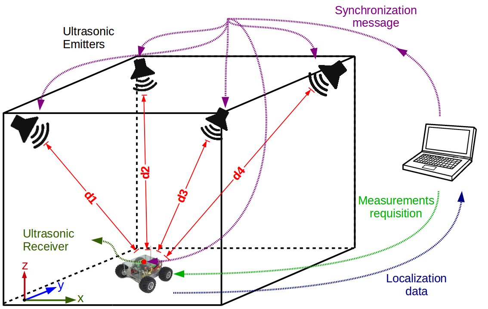

The ultrasonic emitters are fixed around the room at known positions. The ground computer
sends a synchronization message by radio (purple), each emitter answers with an ultrasonic
burst, and the receiver on the vehicle times how long each burst takes to arrive. Those
times of flight give the distances d1…d4 in red. The computer requests the measurements
(green), solves for the position and sends the localization data back to the vehicle
(blue).

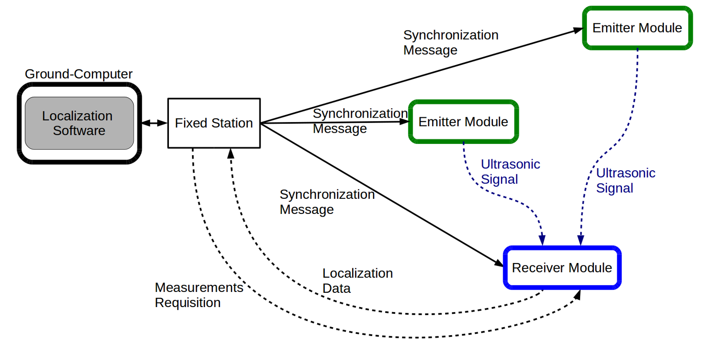

Two radio channels are used: 433 MHz for the synchronization message and 2.4 GHz
(nRF24L01) for requesting measurements and returning data. All radio traffic goes through
the fixed station, which is connected to the ground computer.

Only one emitter can be heard at a time, so each of the eight emitters gets its own time
window after the synchronization message (they fire 70 ms apart). The rest of each
one-second cycle is used to collect the measurements over the radio link and compute the
position, which sets the 1 Hz update rate.

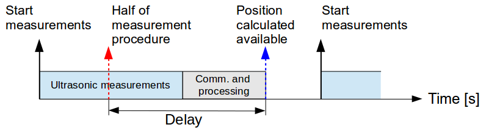

A consequence of this cycle is a transport delay: a position describes where the receiver
was around the middle of the measurement window, but it only becomes available after the
communication and processing time. The delay is about 0.5 s and the simulation study
below includes it.

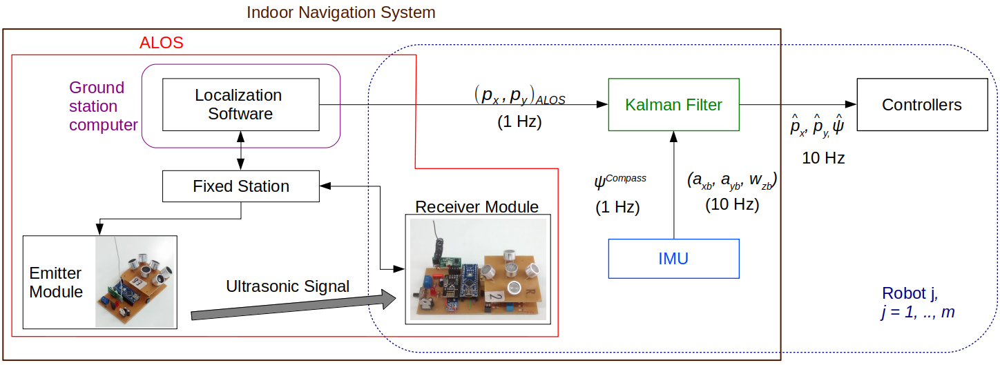

On the vehicle, the ALOS position (1 Hz) is fused with the digital compass (1 Hz) and the
IMU (10 Hz) to give position and heading estimates at 10 Hz for the controllers. The same
ALOS installation can serve several robots, each with its own receiver module.

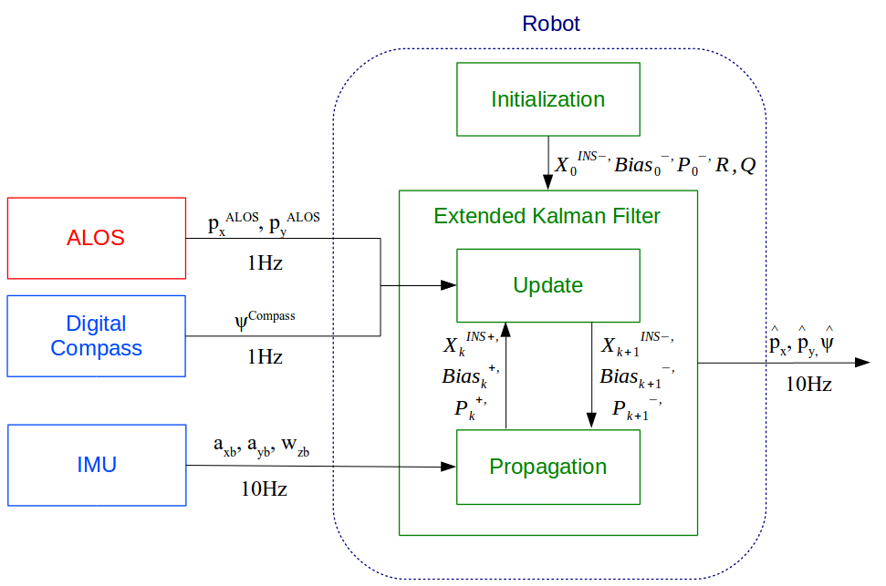

The fusion is an extended Kalman filter. The IMU drives the propagation step at 10 Hz and
the ALOS position and compass heading drive the update step at 1 Hz; the filter also
estimates the sensor biases.

## Hardware

| Emitter (fixed) | Receiver (on the robot) | Fixed station |
|---|---|---|
| 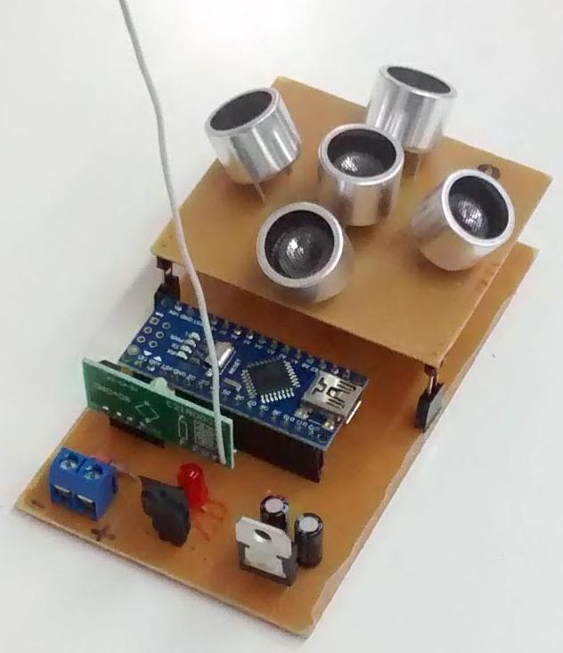 | 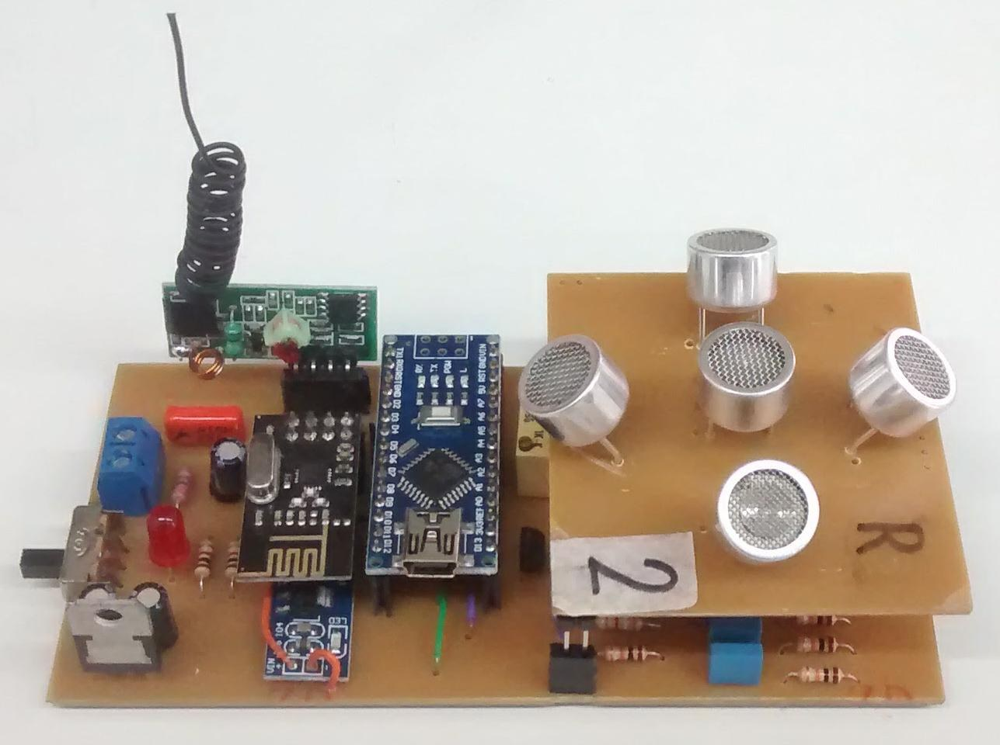 | 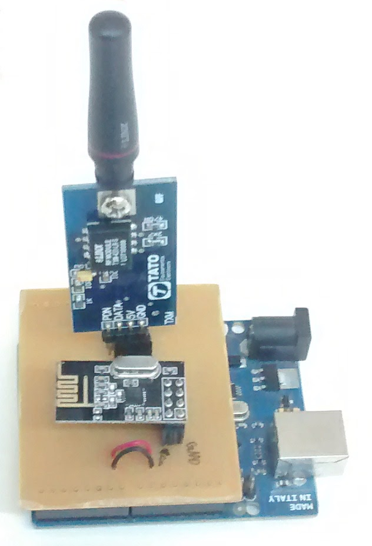 |
| 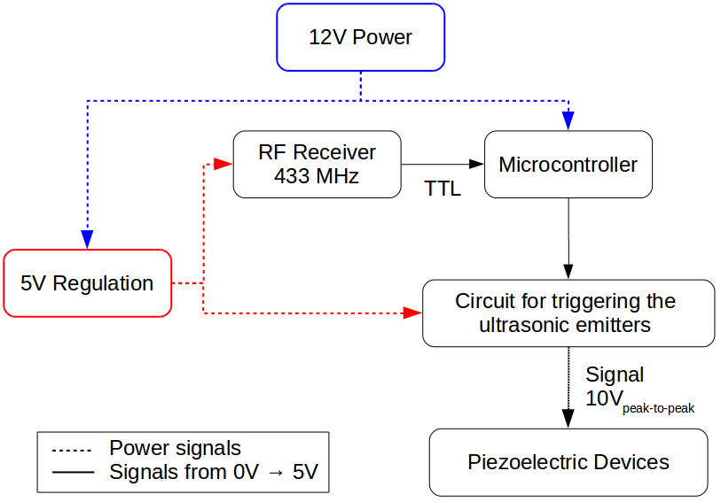 | 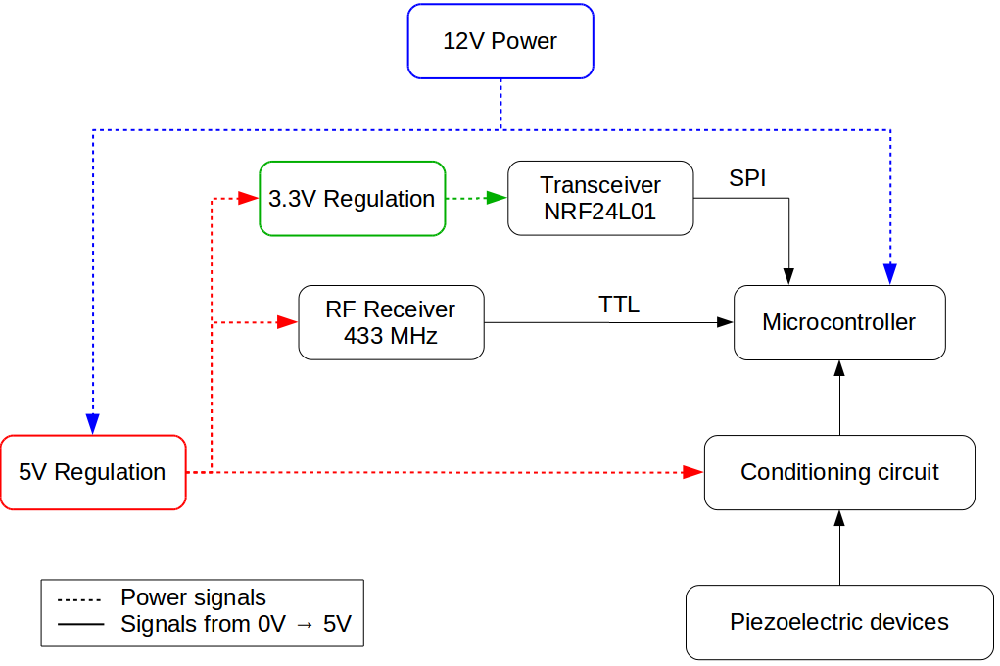 | 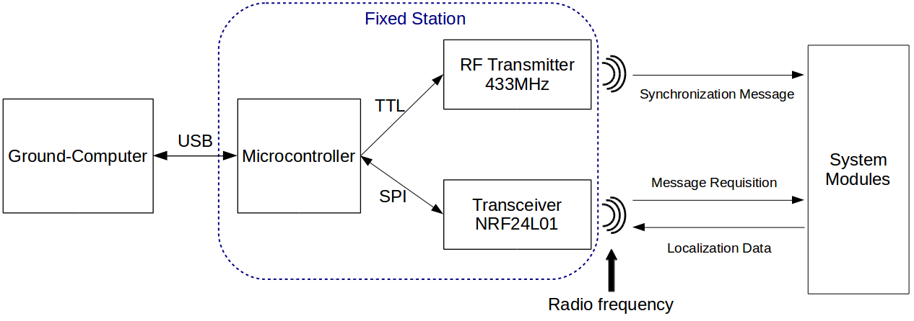 |
| A microcontroller listens for the 433 MHz synchronization message and triggers a circuit that drives the piezoelectric transducers at 10 V peak-to-peak. Several transducers point in different directions to widen the coverage. | The same 433 MHz receiver for synchronization, an nRF24L01 transceiver to return the measurements, and a conditioning circuit between the piezoelectric transducers and the microcontroller. | A microcontroller with a 433 MHz transmitter and an nRF24L01 transceiver, connected to the ground computer over USB. |

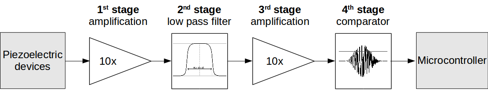

In the receiver, the signal from the piezoelectric transducers is amplified, filtered,
amplified again and passed through a comparator, so the microcontroller sees a clean
digital edge when the burst arrives.

All three boards were designed in Proteus; the projects, schematic PDFs and Gerber files
are in `hardware/`.

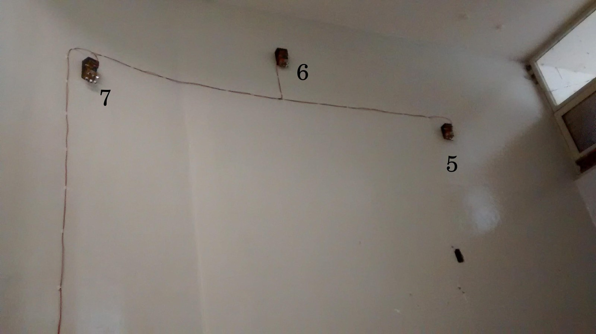

The emitters were mounted high on the walls of the test room. The photo shows three of
the eight.

## Software

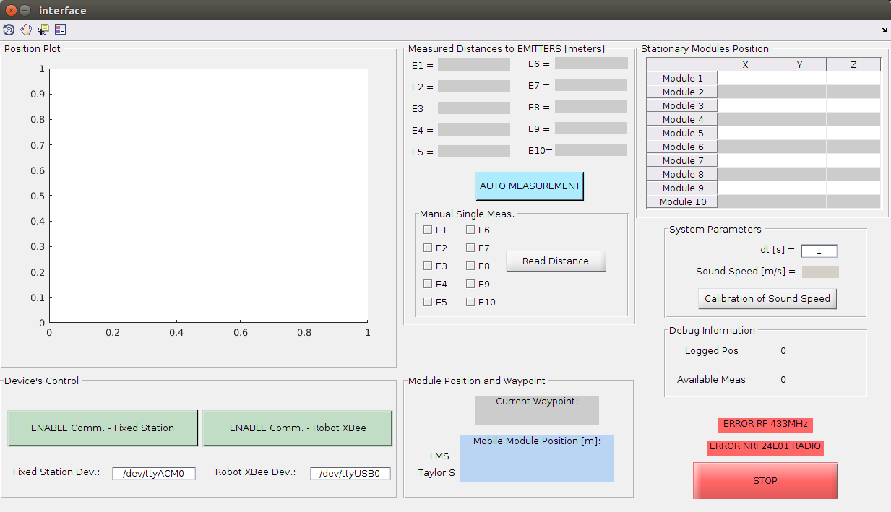

The PC side is a MATLAB GUI. It shows the eight measured distances, the emitter positions,
the computed position of the mobile module (least squares and Taylor series) on a 3D plot,
and the waypoint the robot is currently heading to. It also runs the speed-of-sound
calibration.

## Results

### Range measurements

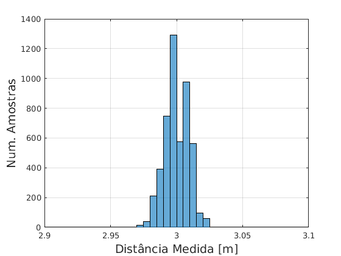

Repeated measurements between one emitter and one receiver placed 3 m apart. The readings
stay within a few centimetres of the true distance, which is the raw accuracy the position
solver starts from.

### Static position accuracy

| Receivers at ground level | Receivers at 70 cm height |
|---|---|
| 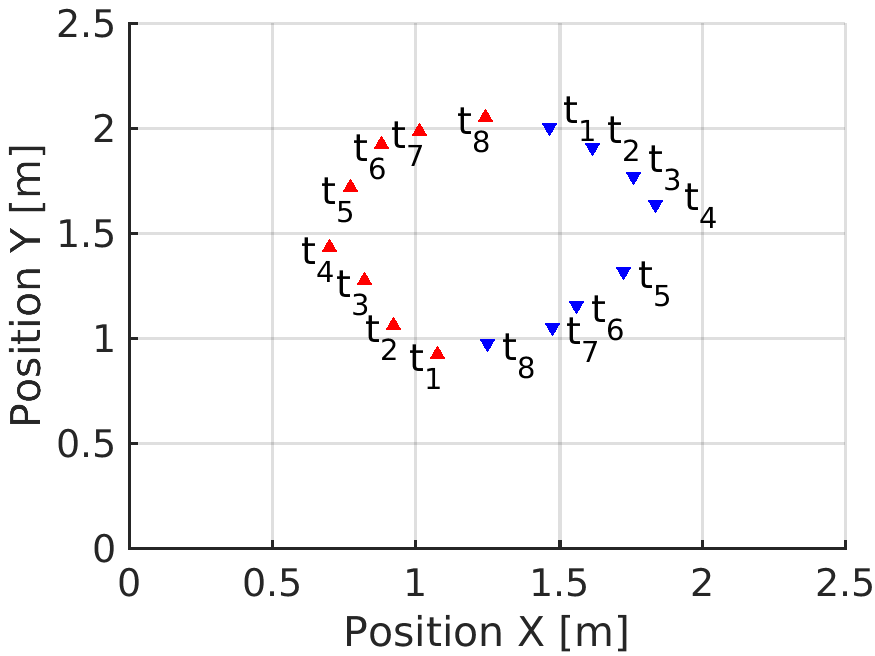 | 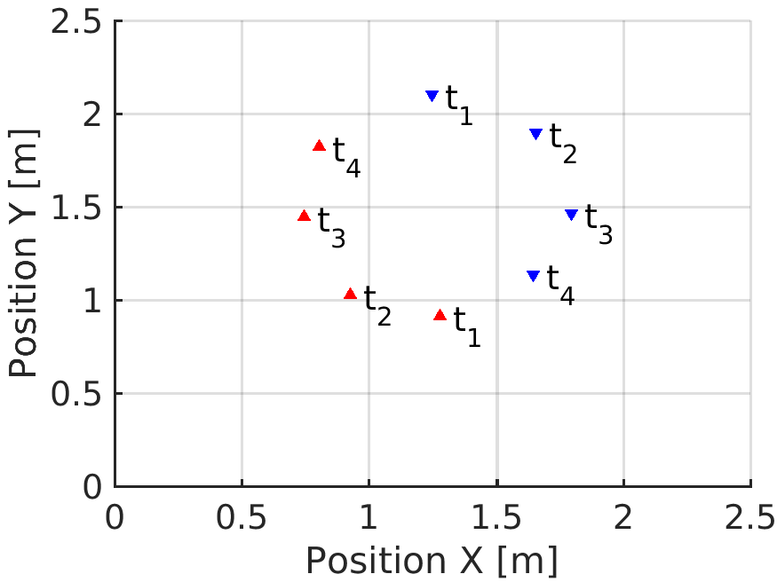 |

Two receiver modules (red and blue markers) were placed by hand at a sequence of points
t1, t2, … while ALOS computed their positions once per second. The accuracy of the
position estimate in this experiment was around 3 cm.

### Simulated quadrotors

| | |
|---|---|
| 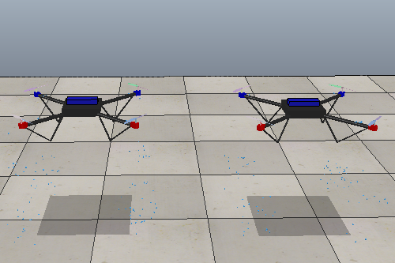 | 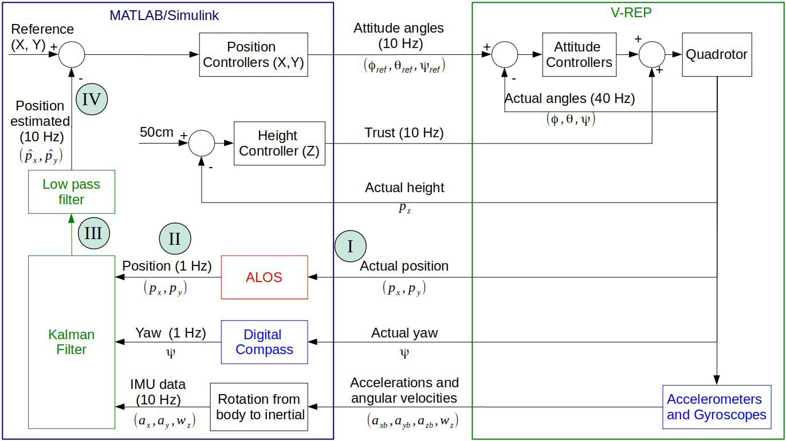 |

The complete navigation system was tested in simulation with two quadrotors. V-REP runs
the quadrotor dynamics and attitude controllers; MATLAB/Simulink runs the position
controllers, the Kalman filter and a model of ALOS; ROS carries the messages between
them. The ALOS block reproduces what was measured on the real system: 3 cm accuracy,
0.5 s transport delay and a 1 Hz rate.

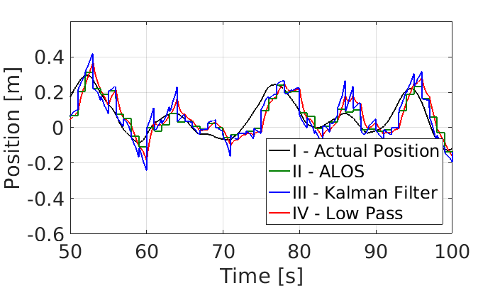

The curves correspond to the numbered points in the block diagram: the actual position
(I), the delayed 1 Hz ALOS measurement (II), the Kalman filter output (III) and its
low-pass filtered version (IV) that feeds the position controllers.

| Quadrotor 1 | Quadrotor 2 |
|---|---|
| 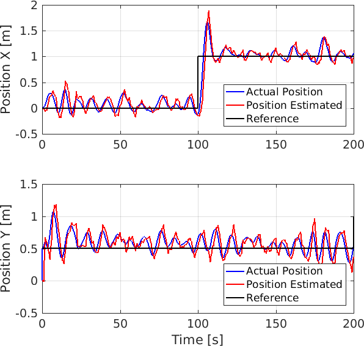 | 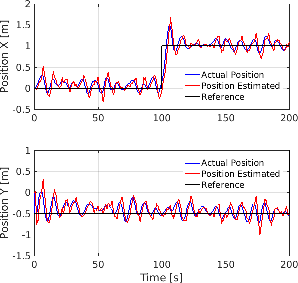 |

Both quadrotors receive a change in the desired X position at the same time while holding
Y. The plots show the reference, the actual position and the estimated position. In the
trajectory-tracking task the RMS error between the Kalman filter output and the true
value was 0.088 m in X, 0.094 m in Y and 1.88° in heading.

### Ground robot (Master's work)

| | |
|---|---|
| 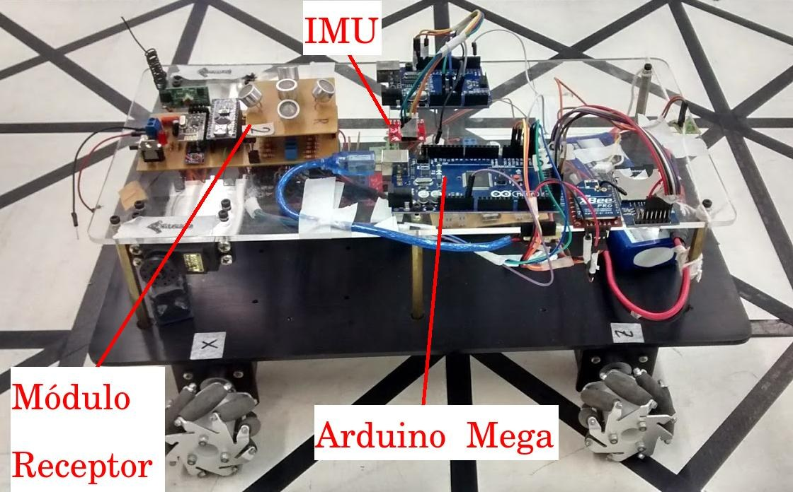 |  |

Beyond the paper, the system was also run on a real mecanum-wheel robot carrying an
Arduino Mega, an IMU and the ALOS receiver module, with the Kalman filter and position
controller on board. The robot followed an hourglass-shaped path through seven waypoints
(black dots; the circles are the acceptance radius around each one). Red circles are the
raw ALOS positions and the blue line is the Kalman filter estimate used by the
controller.

## Videos

- [Ground robot hourglass trajectory, runs 1-3: robot view next to the live localization GUI](https://youtu.be/HVvtlkrMZus)
- [Ground robot test with wall-mounted emitters](https://youtu.be/pdVNUMOguDg)
- [Quadrotor altitude test on a guided test stand](https://youtu.be/xUeMERxlmYQ)

## Structure

| Folder | Contents |
|---|---|
| `firmware/` | Arduino sketches. `emissor_us`, `receptor_us` and `modulo_fixo` are the three ALOS modules (emitter, receiver, fixed station). `RoboSolo_*` and `GroundRobot*` run the ground robot (AHRS, Kalman filter, controllers, SD logging, XBee). `quadMainSoftware_*`, `Teste_altura` and `coletar_dados_imu_vooQuad` are for the real quadrotor. `AHRS*` are standalone attitude estimators. |
| `matlab/location_system/` | The PC side: a MATLAB GUI (`LocationSystem_v2.m`, `interface.m`) that talks to the fixed station over serial, calibrates the speed of sound and computes positions (`LS.m`, `taylor_series.m`, `aml.m`). The GUI layout file `interface.fig` and the logs of the two-receiver session are not included, so the layout has to be rebuilt in GUIDE before the GUI runs. |
| `matlab/localization_algorithms/` | Offline comparison of trilateration, least squares, Taylor series and AML, and a study of emitter placement. |
| `matlab/kalman3d/` | Standalone 3D Kalman filter fusing ALOS position with IMU data. |
| `matlab/tools/` | Small scripts: log import, outlier (Hampel) filter test, accelerometer vibration FFT, calibration simulation. |
| `hardware/` | Proteus projects, schematic PDFs and CAD/CAM (Gerber) archives for the emitter, receiver and fixed-station boards. |
| `experiments/` | Raw logs, plotting scripts and result figures. `Estudo_Caso_1_Robo_Solo` is the ground-robot case study and `Estudo_Caso_2_Quad_Simulado` the simulated quadrotor; the rest are module characterization tests and real-quadrotor flight logs. |
| `sim/` | V-REP scenes of the ELEV-8 quadrotor. |
| `presentation/` | Conference slides. |

Folder and file names inside `firmware/` and `experiments/` are the original Portuguese
ones, and so are most code comments.

## Install

- **Firmware:** Arduino IDE. Libraries: VirtualWire, RF24, SparkFun LSM9DS1, MatrixMath, SD.
  The robot and quadrotor sketches target an Arduino Mega 2560.
- **MATLAB:** written with R2016a-era MATLAB; the GUI needs serial port access. The
  simulated-quadrotor study also needs Simulink and V-REP 3.x.
- **Hardware:** Proteus 8 to open the `.pdsprj` projects.

## Run

- **Localization only:** flash `emissor_us` on each emitter (set `emitter_number`),
  `receptor_us` on the receiver and `modulo_fixo` on the fixed station, connect the fixed
  station by USB and run `matlab/location_system/LocationSystem_v2.m`.
- **Reproduce the paper plots:** run the `plot_*_paper.m` scripts in
  `experiments/Estudo_Caso_1_Robo_Solo/exp4_completo/` from that folder.
- **Simulated quadrotor:** open a scene from `sim/` in V-REP, copy the remote API bindings
  (`remApi.m`, `remoteApiProto.m` and the `remoteApi` library) from your V-REP install
  into `experiments/Estudo_Caso_2_Quad_Simulado/`, then run the Simulink model there.

## Third-party code

- `firmware/AHRS`, `firmware/AHRS_ArduinoUNO` and `firmware/AHRS_ArduinoUNO_v2` are based
  on the AHRS program by coauthor Prof. Sérgio Ronaldo Barros dos Santos, whose author
  header is kept; that program in turn derives from the open-source SparkFun 9DOF Razor
  AHRS project (`sf9domahrs`). These files are not covered by this repo's MIT license.
- The V-REP remote API bindings are not included; they ship with V-REP.

## Status

Finished research code from 2017–2018, kept as an archive. Nothing here has been re-run
since.

## Cleanup notes

- **2026-10-03:** source code added. Not included: the dissertation and paper sources,
  component datasheets, vendor CAD for the ELEV-8 frame, unused/discarded experiment runs,
  and the learning-automata controller tuning code. Absolute paths in scripts were made
  relative, and the lines that moved exported figures into the dissertation folder were
  commented out. The README and this cleanup were done with AI assistance (Claude).
