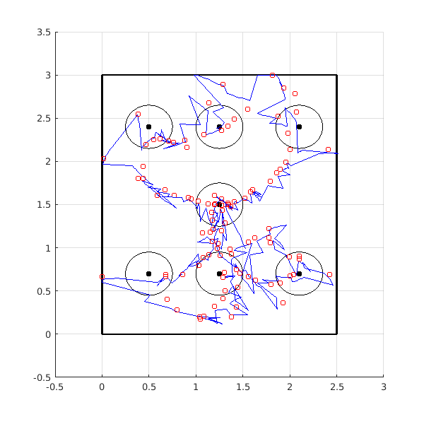

# ALOS

Source code, firmware, PCB designs and experiment data for **"ALOS: Acoustic Localization
System Applied to Indoor Navigation of UAVs"** (ICCSPA 2019), by Kleber M. Cabral,
Sérgio R. Barros dos Santos, Cairo L. Nascimento Jr., and Sidney N. Givigi Jr., derived
from Kleber's Master's work at ITA (2017–2018).

**Paper:** [doi:10.1109/ICCSPA.2019.8713689](https://doi.org/10.1109/ICCSPA.2019.8713689) ·
**Slides:** [presentation/ICCSPA2019_slides.pdf](presentation/ICCSPA2019_slides.pdf)

## What it does

ALOS is an indoor localization system built from low-cost ultrasonic modules. Eight fixed
emitters fire in turn, synchronized by a 433 MHz RF pulse from a fixed station; a receiver
on the vehicle measures each time of flight and reports it over an nRF24L01 link. A PC
turns the ranges into a position (least squares, Taylor series or approximate maximum
likelihood), and an extended Kalman filter fuses that position with the vehicle's IMU.
The system gives a 3D position at about 1 Hz.

It was validated with a ground robot driving in a 2.5 m × 3 m area and with a simulated
quadrotor in V-REP that uses the measured ALOS error characteristics.

## Structure

| Folder | Contents |
|---|---|
| `firmware/` | Arduino sketches. `emissor_us`, `receptor_us` and `modulo_fixo` are the three ALOS modules (emitter, receiver, fixed station). `RoboSolo_*` and `GroundRobot*` run the ground robot (AHRS, Kalman filter, controllers, SD logging, XBee). `quadMainSoftware_*`, `Teste_altura` and `coletar_dados_imu_vooQuad` are for the real quadrotor. `AHRS*` are standalone attitude estimators. |
| `matlab/location_system/` | The PC side: a MATLAB GUI (`LocationSystem_v2.m`, `interface.m`) that talks to the fixed station over serial, calibrates the speed of sound and computes positions (`LS.m`, `taylor_series.m`, `aml.m`). The `.mat` files are logs from a two-receiver session. |
| `matlab/localization_algorithms/` | Offline comparison of trilateration, least squares, Taylor series and AML, and a study of emitter placement. |
| `matlab/kalman3d/` | Standalone 3D Kalman filter fusing ALOS position with IMU data. |
| `matlab/tools/` | Small scripts: log import, outlier (Hampel) filter test, accelerometer vibration FFT, calibration simulation. |
| `hardware/` | Proteus projects, schematic PDFs and CAD/CAM (Gerber) archives for the emitter, receiver and fixed-station boards. |
| `experiments/` | Raw logs, plotting scripts and result figures. `Estudo_Caso_1_Robo_Solo` is the ground-robot case study and `Estudo_Caso_2_Quad_Simulado` the simulated quadrotor; the rest are module characterization tests and real-quadrotor flight logs. |
| `sim/` | V-REP scenes of the ELEV-8 quadrotor. |
| `presentation/` | Conference slides. |

Folder and file names inside `firmware/` and `experiments/` are the original Portuguese
ones, and so are most code comments.

## Install

- **Firmware:** Arduino IDE. Libraries: VirtualWire, RF24, SparkFun LSM9DS1, MatrixMath, SD.
  The robot and quadrotor sketches target an Arduino Mega 2560.
- **MATLAB:** written with R2016a-era MATLAB; the GUI needs serial port access. The
  simulated-quadrotor study also needs Simulink and V-REP 3.x.
- **Hardware:** Proteus 8 to open the `.pdsprj` projects.

## Run

- **Localization only:** flash `emissor_us` on each emitter (set `emitter_number`),
  `receptor_us` on the receiver and `modulo_fixo` on the fixed station, connect the fixed
  station by USB and run `matlab/location_system/LocationSystem_v2.m`.
- **Reproduce the paper plots:** run the `plot_*_paper.m` scripts in
  `experiments/Estudo_Caso_1_Robo_Solo/exp4_completo/` from that folder.
- **Simulated quadrotor:** open a scene from `sim/` in V-REP, copy the remote API bindings
  (`remApi.m`, `remoteApiProto.m` and the `remoteApi` library) from your V-REP install
  into `experiments/Estudo_Caso_2_Quad_Simulado/`, then run the Simulink model there.

## Third-party code

- `firmware/AHRS`, `firmware/AHRS_ArduinoUNO` and `firmware/AHRS_ArduinoUNO_v2` are based
  on the AHRS program by coauthor Prof. Sérgio Ronaldo Barros dos Santos, whose author
  header is kept; that program in turn derives from the open-source SparkFun 9DOF Razor
  AHRS project (`sf9domahrs`). These files are not covered by this repo's MIT license.
- The V-REP remote API bindings are not included; they ship with V-REP.

## Status

Finished research code from 2017–2018, kept as an archive. Nothing here has been re-run
since.

## Cleanup notes

- **2026-10-03:** source code added. Not included: the dissertation and paper sources,
  component datasheets, vendor CAD for the ELEV-8 frame, unused/discarded experiment runs,
  and the learning-automata controller tuning code. Absolute paths in scripts were made
  relative, and the lines that moved exported figures into the dissertation folder were
  commented out. The README and this cleanup were done with AI assistance (Claude).
